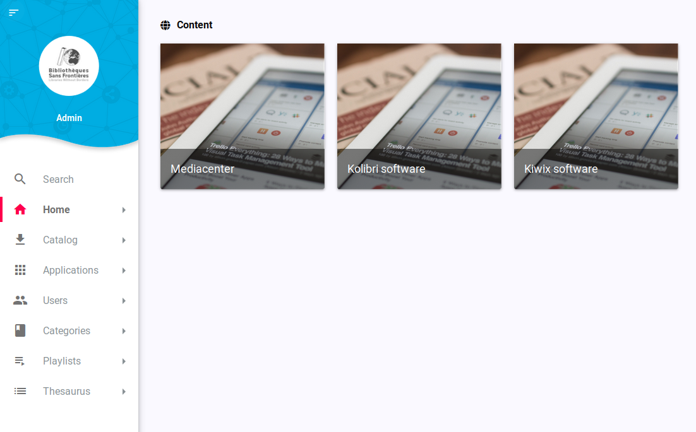

# OLIP deploy

OLIP is a platform able to handle WebApp based on container and pull content from IPFS network



This Ansible playbook use a set of roles to deploy OLIP platform.

OLIP uses an IPFS-backed Docker Registry to pull image from. Each images are then handled by OLIP to start containers from (webapp). Each webapp is able to pull content from IPFS network as well.

## Initialization

### Descriptor file

This file specify what webapp to intall and what content to use. Docker images and content are stored on [IPFS](http://ipfs.io/), [see a short video about IPFS](https://www.youtube.com/watch?v=5Uj6uR3fp-U)
The file [descriptor.json](descriptor.json) must be published from an IPFS node in order for OLIP to pull this file and show you what container and content is available.

To speed up link between node you may want to connect them directly through the swarm

**Node A**

```
$ ipfs id
/ip4/123.123.123.123/tcp/4001/ipfs/QmasuyJZNTGLEk5PbLE4564678yybPJU235Y1Giz9i9tPwP
```

In this array of multiaddrs, get the line with the public address of the node. Node behind a NAT are difficult to reach out

**Node B**

```
$ ipfs swarm connect /ip4/123.123.123.123/tcp/4001/ipfs/QmasuyJZNTGLEk5PbLE4564678yybPJU235Y1Giz9i9tPwP
connect QmasuyJZNTGLEk5PbLE4564678yybPJU235Y1Giz9i9tPwP success
```

This way IPFS will be faster at discovering content

#### Publish the descriptor file

```
$ ipfs add descriptor.json
added QmQbMTudjMohE527vBQvGAAWaC3wuM6rcnc3xqMnojRbM7 descriptor.json
```

You can then pass this IPFS Hash to the command line

### With cURL

```
curl -sfL https://github.com/bibliosansfrontieres/olip-deploy/raw/master/go.sh | bash -s -- --name my_platform_name --url my-platform-name.fr --descriptor /ipfs/QmQbMTudjMohE527vBQvGAAWaC3wuM6rcnc3xqMnojRbM7
```

### With Ansible CLI

```
ansible-playbook -i hosts -l my_server -u root main.yml --extra-vars "end_user_server_name=my_platform_name end_user_domain_name=my-platform-name.fr end_user_olip_file_descriptor=QmQbMTudjMohE527vBQvGAAWaC3wuM6rcnc3xqMnojRbM7"
```


There is also an option to specify Docker image version, it can be `latest`, `dev` or `test`

* `olip_dashboard_version=dev`
* `olip_api_version=dev`

Default value is set to `latest`

## Usage

### Update API with latest file descriptor version

```
http://olip.api.my-platform-name.fr:5002/applications/?repository_update=true
```

### Use the dashboard

```
http://olip.my-platform-name.fr
```

### API

```
http://api.olip.my-platform-name.fr:5002
```

## Firewall

Open inbound port :
* `80` for HTTP
* `10000 - 20000` for OLIP WebApp
* `22` for SSH
* `4001` for IPFS swarm
* `5002` for OLIP API

## Logs

Important webapp logs are

### API

```
$ balena-engine logs -f olip-api
```

### IPFS registry

```
$ balena-engine logs -f ipfs-registry
```

### For webapp, exemple

```
$ balena-engine logs -f kolibri.app.kolibri
```
